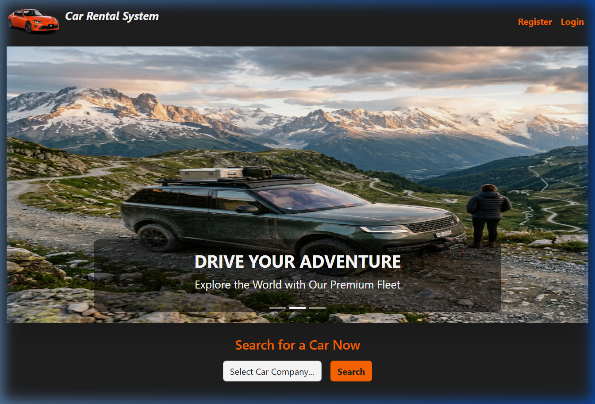
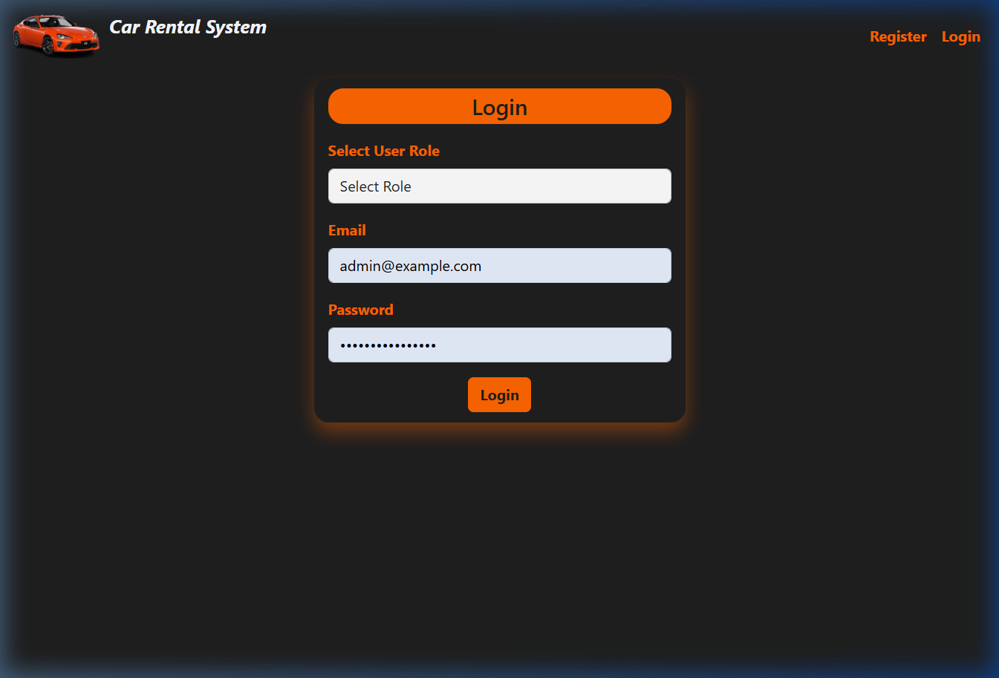
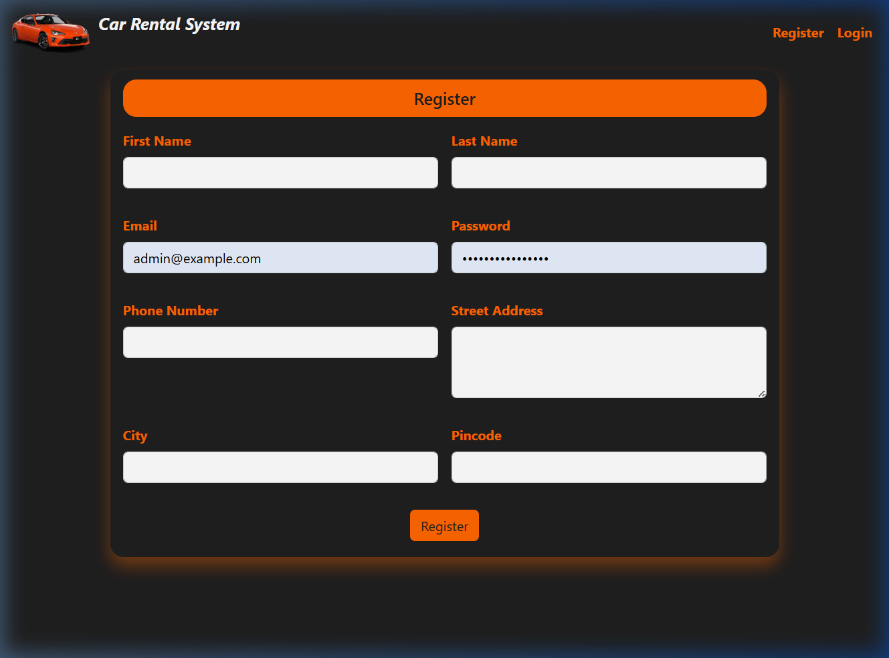
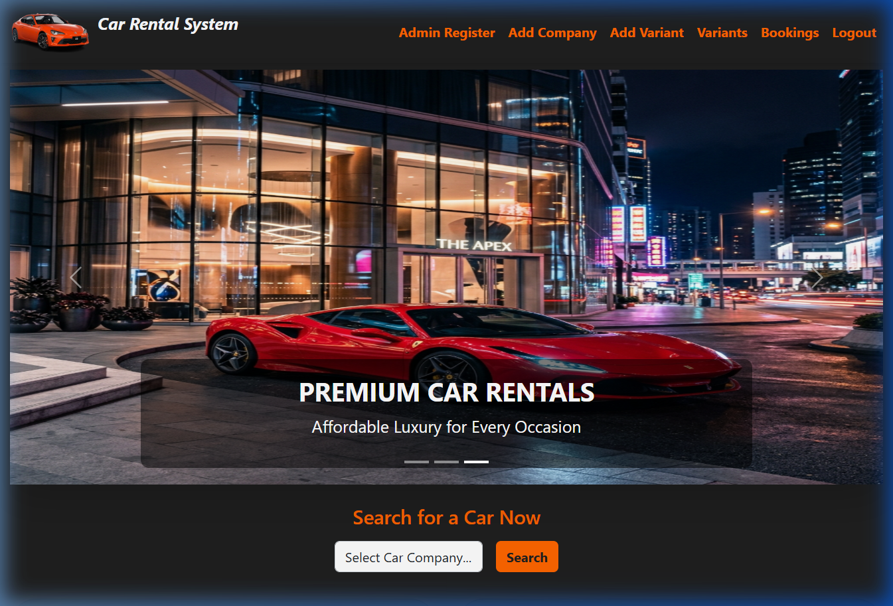

# 🚗 Car Rental System


> **Drive your journey with ease, comfort, and style.** 🌍

**Car Rental System** is a comprehensive full-stack application designed to modernize the vehicle rental process. Built with the robust **Spring Boot** framework and a dynamic **React** frontend, it delivers a seamless experience for customers booking their next ride and administrators managing their fleet.

---

## 🚀 Key Features

### 👤 User Panel
- **Browse & Filter:** Explore a vast fleet of vehicles with advanced filtering options.
- **Secure Booking:** Real-time availability checks and secure reservation processing.
- **User Dashboard:** Manage profile, view booking history, and track status.
- **Responsive Interface:** Optimized for a smooth experience on any device.

### 🛡️ Admin Dashboard
- **Fleet Management:** Add, update, or decommission vehicles with ease.
- **Reservation Control:** Approve or reject bookings and view detailed itineraries.
- **User Oversight:** Manage registered users and handle support queries.
- **Data Insights:** Visualize key metrics like rental frequency and revenue.

---

## 🛠️ Technology Stack

*   **Frontend:** React (v18), Bootstrap 5, Axios, React Toastify
*   **Backend:** Spring Boot (v3.2), Spring Security (JWT), Spring Data JPA
*   **Database:** MySQL
*   **Tools:** Maven, OpenPDF (for report generation)

---

## � Data Model

The application utilizes a relational database structure designed for integrity and scalability:

1.  **User:** Stores customer and admin profiles, authentication details.
2.  **Vehicle:** Core entity representing cars with attributes like model, year, and status.
3.  **Variant:** Defines specific car variations (e.g., color, transmission type).
4.  **Booking:** Connects users to vehicles for specific timeframes.
5.  **Payment:** Tracks transaction details for reservations.
6.  **Address:** Stores user and pickup/drop-off location data.
7.  **DrivingLicense:** Validates user eligibility for rentals.
8.  **Company:** Manages company-specific data for fleet owners.

---

## 📸 Screenshots

| Homepage | Login Page |
|:---:|:---:|
|  |  |

| Register Page | Admin Dashboard |
|:---:|:---:|
|  |  |


---

## 🏁 Getting Started

1.  **Clone the repository:**
    ```bash
    git clone https://github.com/AkshayNeminathHarugeri/Car_rental_System_JavaFullStackProject.git
    cd Car_rental_System_JavaFullStackProject
    ```

2.  **Backend Setup:**
    - Navigate to `car-rental-system-backend`.
    - Configure MySQL credentials in `application.properties`.
    - Run: `./mvnw spring-boot:run`

3.  **Frontend Setup:**
    - Navigate to `car-rental-system-frontend`.
    - Install dependencies: `npm install`
    - Start app: `npm start`
